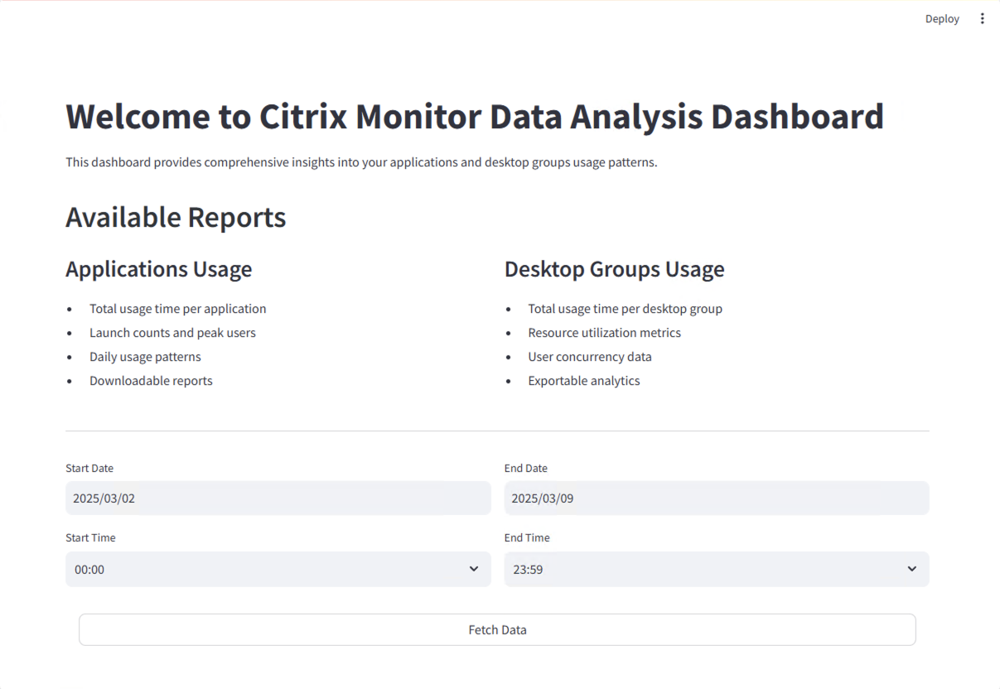

<h1 align="center">Citrix Monitor Data Analysis Dashboard</h1>

## Overview
This Streamlit-based dashboard provides comprehensive insights into applications and desktop groups usage patterns. It visualizes monitoring data with interactive charts and downloadable reports.

## Features
- **Date and Time Range Selection**: Flexible data filtering
- **Applications Usage Analysis**:
  - Total usage time per application
  - Launch counts and peak users
  - Daily usage patterns
  - Downloadable reports

- **Desktop Groups Usage Analysis**:
  - Total usage time per desktop group
  - Resource utilization metrics
  - User concurrency data
  - Exportable analytics

## Installation

1. Clone the repository:
```bash
git clone https://github.com/badacoolye/ctx-mon-dash.git

cd ctx-mon-dash
```

2. Create Python virtual environment:
```bash
python -m venv .venv
```

3. Activate Python virtual environment:
```bash
source .venv/bin/activate # MacOS

.\.venv\Scripts\activate #Windows Pwsh
```

4. Install required packages:
```bash
pip install -r requirements.txt
```

5. Clone environment file:
```bash
cp env.example .env
```

## Usage

1. Run the Streamlit application:
```bash
streamlit run main.py
```

2. Access the dashboard through your web browser (typically http://localhost:8501)

## Requirements
- Python 3.8+
- Streamlit 1.31.0
- Pandas 2.2.0
- Plotly 5.18.0
- Additional dependencies listed in requirements.txt

## Data Download
The dashboard provides CSV export functionality for:
- Applications usage data
- Desktop groups usage data

## Contributing
Feel free to submit issues and enhancement requests.

## License
MIT License
